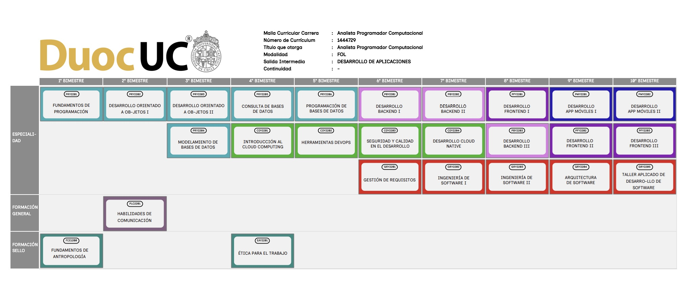
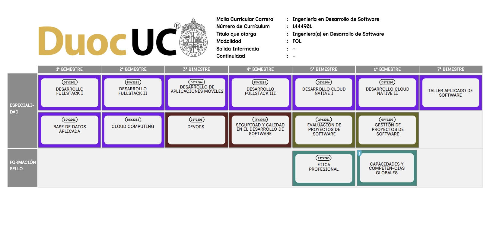
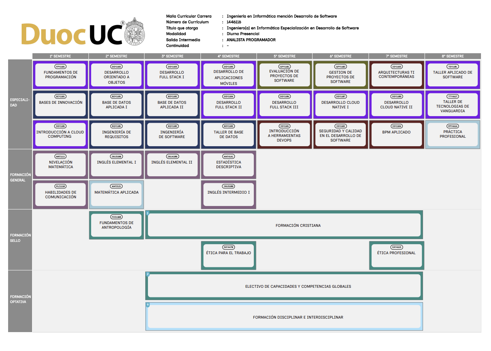
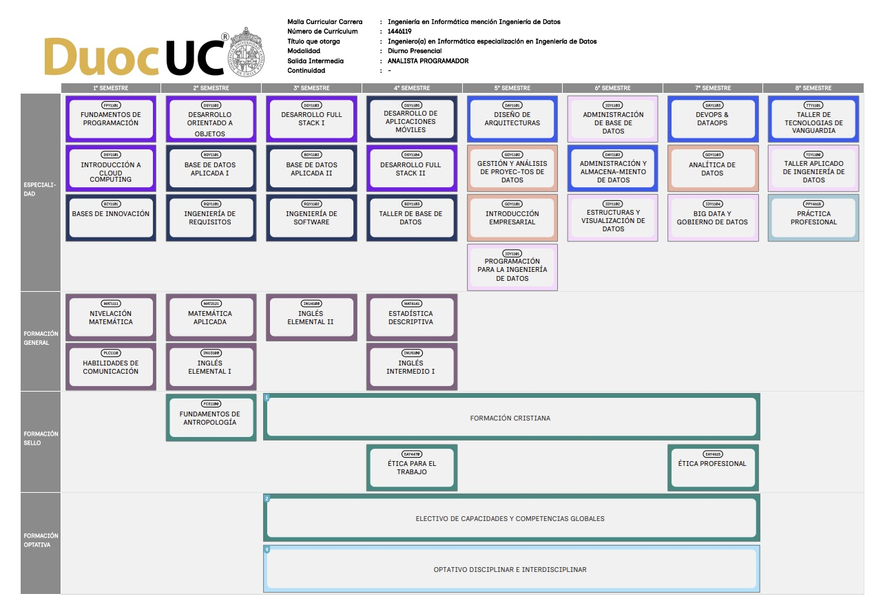
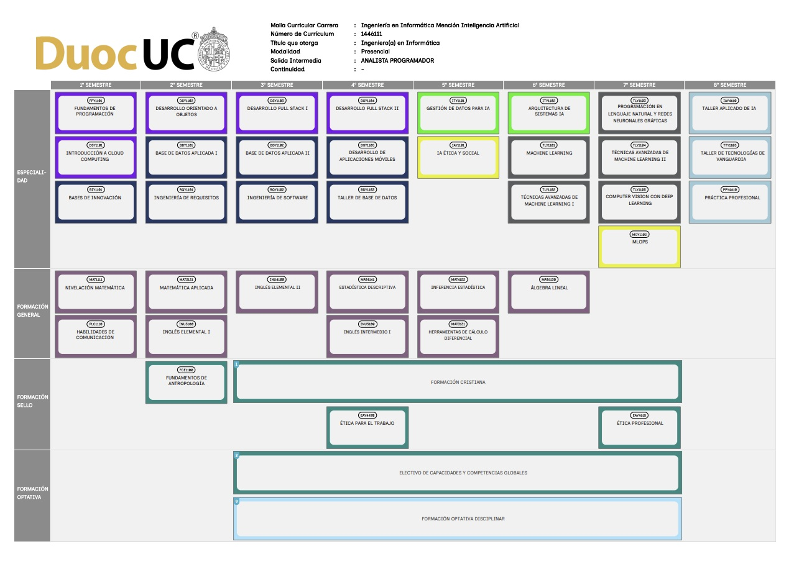
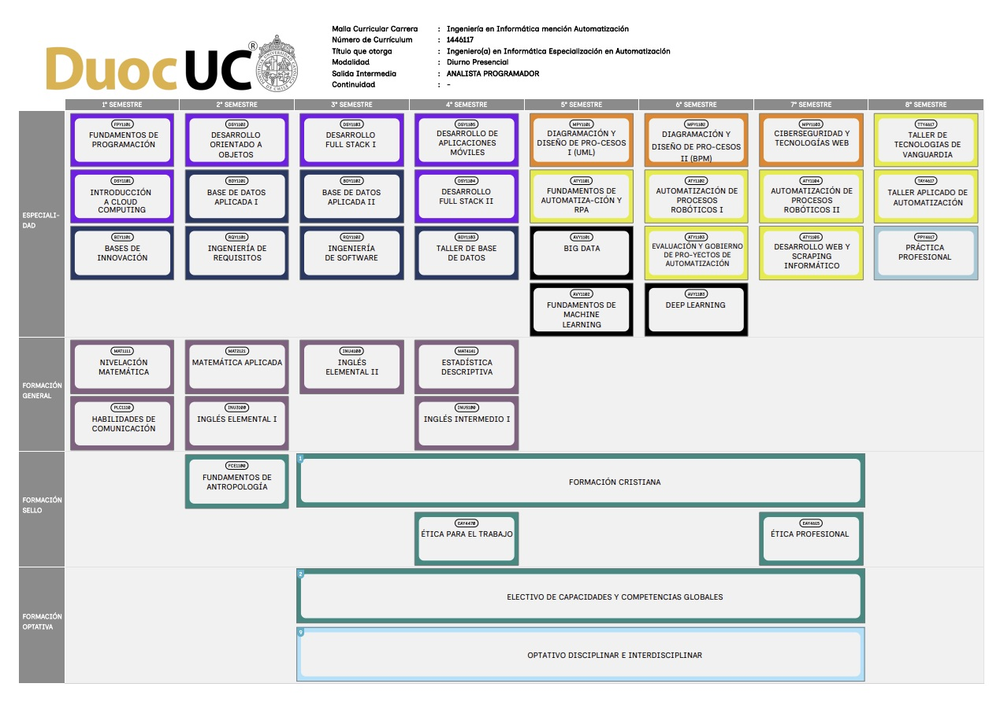
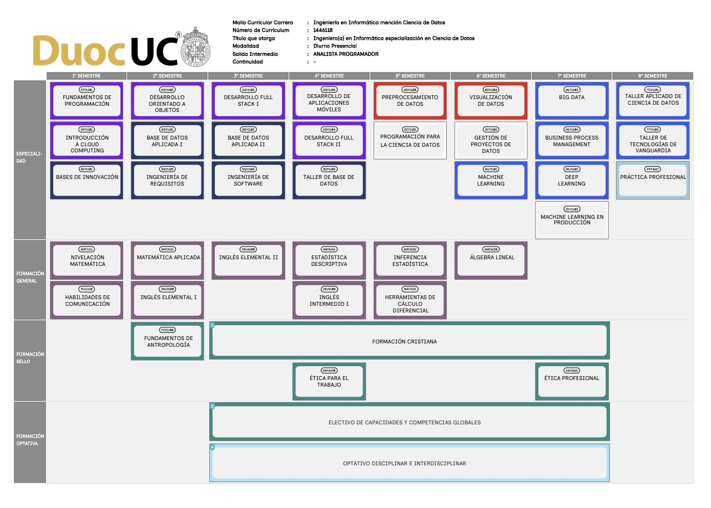
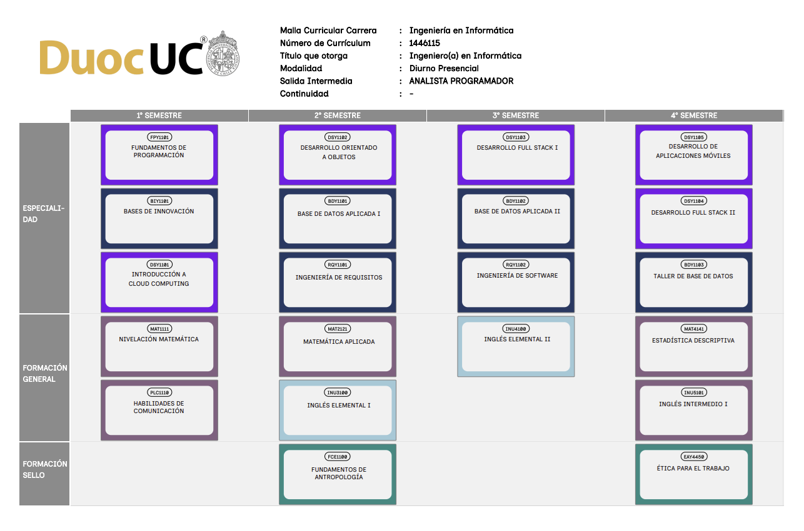

<div align="center">

<!-- HEADER PREMIUM - WAVE GRADIENT -->


<!-- TÍTULO PRINCIPAL -->
<br>

<a href="#">

</a>

<a href="#">

</a>

<br>


<br><br>

<!-- STATS BADGES -->


<br>

<details>
<summary><b>📋 Ver Mallas Curriculares 2025</b></summary>
<br>

### 🌐 Online

<table>
<tr>
<td align="center">

**🥈 Analista Programador Computacional**

<sub>10 Bimestres · Título Técnico</sub>

<a href="resources/mallas/malla-tecnico-2025.jpg">

</a>

</td>
<td align="center">

**🥇 Ingeniería en Desarrollo de Software**

<sub>7 Bimestres · Continuidad</sub>

<a href="resources/mallas/malla-ing-software-2025.jpg">

</a>

</td>
</tr>
</table>

### 🏫 Presencial

<table>
<tr>
<td align="center">

**💻 Ing. Informática - Desarrollo de Software**

<sub>8 Semestres · Presencial Diurno</sub>

<a href="resources/mallas/malla-presencial-desarrollo-software.png">

</a>

</td>
<td align="center">

**📊 Ing. Informática - Ingeniería de Datos**

<sub>8 Semestres · Presencial Diurno</sub>

<a href="resources/mallas/malla-presencial-ingenieria-datos.jpg">

</a>

</td>
<td align="center">

**🤖 Ing. Informática - Inteligencia Artificial**

<sub>8 Semestres · Presencial Diurno</sub>

<a href="resources/mallas/malla-presencial-inteligencia-artificial.jpg">

</a>

</td>
</tr>
<tr>
<td align="center">

**⚙️ Ing. Informática - Automatización**

<sub>8 Semestres · Presencial Diurno</sub>

<a href="resources/mallas/malla-presencial-automatizacion.jpg">

</a>

</td>
<td align="center">

**🔬 Ing. Informática - Ciencia de Datos**

<sub>8 Semestres · Presencial Diurno</sub>

<a href="resources/mallas/malla-presencial-ciencia-datos.jpg">

</a>

</td>
<td align="center">

**🎓 Ingeniería en Informática**

<sub>8 Semestres · Presencial Diurno</sub>

<a href="resources/mallas/malla-presencial-informatica.png">

</a>

</td>
</tr>
</table>

</details>


</div>

---

##  Stack Tecnológico

<div align="center">

<table>
<tr>
<td align="center" colspan="7">
<h3>💻 Lenguajes de Programación</h3>
</td>
</tr>
<tr>
<td align="center" width="120">

<br><b>Java</b>
</td>
<td align="center" width="120">

<br><b>Python</b>
</td>
<td align="center" width="120">

<br><b>JavaScript</b>
</td>
<td align="center" width="120">

<br><b>TypeScript</b>
</td>
<td align="center" width="120">

<br><b>Kotlin</b>
</td>
<td align="center" width="120">

<br><b>SQL</b>
</td>
<td align="center" width="120">

<br><b>HTML5</b>
</td>
</tr>
</table>

<!-- BACKEND & FRONTEND -->
<table>
<tr>
<td align="center" colspan="4">
<h3>⚙️ Backend</h3>
</td>
<td align="center" colspan="4">
<h3>🎨 Frontend</h3>
</td>
</tr>
<tr>
<td align="center" width="100">

<br><sub><b>Spring Boot</b></sub>
</td>
<td align="center" width="100">

<br><sub><b>Node.js</b></sub>
</td>
<td align="center" width="100">

<br><sub><b>Express</b></sub>
</td>
<td align="center" width="100">

<br><sub><b>JPA/Hibernate</b></sub>
</td>
<td align="center" width="100">

<br><sub><b>Angular</b></sub>
</td>
<td align="center" width="100">

<br><sub><b>React</b></sub>
</td>
<td align="center" width="100">

<br><sub><b>Bootstrap</b></sub>
</td>
<td align="center" width="100">

<br><sub><b>CSS3</b></sub>
</td>
</tr>
</table>

<!-- MOBILE & DATABASE -->
<table>
<tr>
<td align="center" colspan="3">
<h3>📱 Mobile</h3>
</td>
<td align="center" colspan="5">
<h3>🗄️ Bases de Datos</h3>
</td>
</tr>
<tr>
<td align="center" width="100">

<br><sub><b>Android</b></sub>
</td>
<td align="center" width="100">

<br><sub><b>Ionic</b></sub>
</td>
<td align="center" width="100">

<br><sub><b>Firebase</b></sub>
</td>
<td align="center" width="100">

<br><sub><b>Oracle</b></sub>
</td>
<td align="center" width="100">

<br><sub><b>PostgreSQL</b></sub>
</td>
<td align="center" width="100">

<br><sub><b>MySQL</b></sub>
</td>
<td align="center" width="100">

<br><sub><b>MongoDB</b></sub>
</td>
<td align="center" width="100">

<br><sub><b>Redis</b></sub>
</td>
</tr>
</table>

<!-- CLOUD & DEVOPS -->
<table>
<tr>
<td align="center" colspan="8">
<h3>☁️ Cloud & DevOps</h3>
</td>
</tr>
<tr>
<td align="center" width="100">

<br><b>AWS</b>
</td>
<td align="center" width="100">

<br><sub><b>Azure</b></sub>
</td>
<td align="center" width="100">

<br><b>Docker</b>
</td>
<td align="center" width="100">

<br><b>K8s</b>
</td>
<td align="center" width="100">

<br><sub><b>Jenkins</b></sub>
</td>
<td align="center" width="100">

<br><sub><b>CI/CD</b></sub>
</td>
<td align="center" width="100">

<br><sub><b>Terraform</b></sub>
</td>
<td align="center" width="100">

<br><sub><b>Linux</b></sub>
</td>
</tr>
</table>

<!-- TOOLS -->
<table>
<tr>
<td align="center" colspan="8">
<h3>🔧 Herramientas</h3>
</td>
</tr>
<tr>
<td align="center" width="100">

<br><sub><b>Git</b></sub>
</td>
<td align="center" width="100">

<br><b>GitHub</b>
</td>
<td align="center" width="100">

<br><sub><b>VS Code</b></sub>
</td>
<td align="center" width="100">

<br><sub><b>IntelliJ</b></sub>
</td>
<td align="center" width="100">

<br><sub><b>Postman</b></sub>
</td>
<td align="center" width="100">

<br><sub><b>Figma</b></sub>
</td>
<td align="center" width="100">

<br><sub><b>Maven</b></sub>
</td>
<td align="center" width="100">

<br><sub><b>Gradle</b></sub>
</td>
</tr>
</table>

</div>

---

##  Navegación Rápida

<table>
<tr>
<td width="50%" valign="top">

**📘 Año 1 › Semestre 1**

| | **Bimestre 01** | **Bimestre 02** |
|:--|:--|:--|
|  | **[Fundamentos Prog.](Bimestre%2001/Fundamentos-Programacion/)** | **[POO I](Bimestre%2002/Programacion-OO-I/)**  |
|  | **[Modelamiento BD](Bimestre%2001/Modelamiento-BD/)** | **[Cloud](Bimestre%2002/Computacion-Nube/)**  |
| 📚 | [Antropología](Bimestre%2001/Antropologia/) | [Comunicación](Bimestre%2002/Comunicacion/) |

**📗 Año 1 › Semestre 2**

| | **Bimestre 03** | **Bimestre 04** |
|:--|:--|:--|
|  | **[POO II](Bimestre%2003/Programacion-OO-II/)** | **[SQL Consultas](Bimestre%2004/SQL-Consultas/)**  |
|  | **[DevOps](Bimestre%2003/DevOps/)** | **[Seguridad](Bimestre%2004/Seguridad-Informatica/)** 🔐 |
| 📚 | [Ética](Bimestre%2003/Etica/) | |

</td>
<td width="50%" valign="top">

**📙 Año 2 › Semestre 1**

| | **Bimestre 05** 🏆 | **Bimestre 06** |
|:--|:--|:--|
|  | **[SQL Prog.](Bimestre%2005/SQL-Programacion/)** | **[Backend I](Bimestre%2006/Backend-I/)**  |
|  | **[Cloud Native](Bimestre%2005/Cloud-Native/)** | **[Ing. Soft. I](Bimestre%2006/Ingenieria-Software-I/)** 📋 |
| 📋 | [Requisitos](Bimestre%2005/Ingenieria-Requisitos/) | |

**📕 Año 2 › Semestre 2**

| | **Bimestre 07** | **Bimestre 08** | **Bimestre 09** | **Bimestre 10** 🎓 |
|:--|:--|:--|:--|:--|
|  | **[Backend II-III](Bimestre%2007/Backend-II-III/)** | **[Frontend I-II](Bimestre%2008/Frontend-I-II/)**  | **[Mobile I](Bimestre%2009/Mobile-I/)**  | **[Mobile II](Bimestre%2010/Mobile-II/)**  |
| 🏛️ | **[Ing. Soft. II](Bimestre%2007/Ingenieria-Software-II/)** | **[Arquitectura](Bimestre%2008/Arquitectura-Software/)** | **[Frontend III](Bimestre%2009/Frontend-III/)**  | **[Taller Título](Bimestre%2010/Taller-Titulo/)** 🎯 |

</td>
</tr>
</table>

---

##  Trayectoria Académica

<div align="center">


<br><br>

<!-- TIMELINE VISUAL -->
<table>
<tr>
<td align="center" width="220">


<br>

<sub>**FUNDAMENTOS**</sub>

<br><br>

<a href="Bimestre%2001/"></a>

<a href="Bimestre%2002/"></a>

<a href="Bimestre%2003/"></a>

<a href="Bimestre%2004/"></a>

</td>
<td align="center" width="60">


</td>
<td align="center" width="280">


<br>

<a href="Bimestre%2005/"></a>

<br><br>


<br><br>

<table>
<tr>
<td><sub><b>Apps</b></sub></td>
<td></td>
</tr>
<tr>
<td><sub><b>SQL</b></sub></td>
<td></td>
</tr>
<tr>
<td><sub><b>Cloud</b></sub></td>
<td></td>
</tr>
</table>

</td>
<td align="center" width="60">


</td>
<td align="center" width="220">


<br>

<sub>**ESPECIALIZACIÓN**</sub>

<br><br>

<a href="Bimestre%2006/"></a>

<a href="Bimestre%2007/"></a>

<a href="Bimestre%2008/"></a>

<a href="Bimestre%2009/"></a>

</td>
</tr>
</table>

<br>


<br><br>

<!-- TÍTULO FINAL -->


<br><br>

<a href="Bimestre%2010/"></a>

<br><br>


<br><br>

<table>
<tr>
<td align="center"><sub><b>Arquitectura</b></sub></td>
<td align="center"><sub><b>Full-Stack</b></sub></td>
<td align="center"><sub><b>Mobile</b></sub></td>
<td align="center"><sub><b>DevOps</b></sub></td>
<td align="center"><sub><b>Microservices</b></sub></td>
</tr>
<tr>
<td align="center"></td>
<td align="center"></td>
<td align="center"></td>
<td align="center"></td>
<td align="center"></td>
</tr>
</table>

<br>


</div>

---

## 📂 Estructura del Repositorio

```
Analista-Programador-Computacional-DuocUC/
│
├── 📁 apps/
│   └── 📁 astro-site/             ◀━━━ 🌐 Sitio Astro (Tutor AI, recursos)
│
├── 📁 coursework/                 ◀━━━ 📚 Material académico (17 bimestres)
│   ├── 📁 bimestre-XX-<slug>/
│   │   ├── 📄 README.md           ◀━━━ 📋 Índice del bimestre
│   │   └── 📁 <asignatura>/
│   │       ├── 📄 README.md       ◀━━━ 📋 Cheatsheet de la asignatura
│   │       ├── 📁 archivos-curso/ ◀━━━ 📚 Material original del profe
│   │       ├── 📁 actividades/    ◀━━━ 📝 Evaluaciones formativas
│   │       ├── 📁 exp1/           ◀━━━ 🔬 Experiencia 1 (semanas 1-3)
│   │       │   ├── semana-01/
│   │       │   ├── semana-02/
│   │       │   └── semana-03/
│   │       ├── 📁 exp2/           ◀━━━ 🔬 Experiencia 2 (semanas 4-5)
│   │       └── 📁 exp3/           ◀━━━ 🔬 Experiencia 3 (semanas 6-8)
│
├── 📁 resources/                  ◀━━━ 🎒 Mallas, plantillas, referencias
│   ├── 📁 mallas/
│   ├── 📁 documentos/
│   └── 📁 plantillas/
│
├── 📁 docs/                       ◀━━━ 📖 Documentación del repo
│   ├── 📄 context.md              ◀━━━ 🧠 Snapshot vivo del proyecto
│   ├── 📁 sessions/               ◀━━━ 📅 Bitácora de sesiones de trabajo
│   ├── 📄 conventions.md
│   ├── 📁 architecture/
│   └── 📁 archive/                ◀━━━ 🗄️ Docs históricos
│
├── 📁 scripts/                    ◀━━━ 🔧 Helpers (update-context.sh, etc.)
│
├── 📄 pyproject.toml              ◀━━━ 🐍 uv coursework Python (3.13)
├── 📄 .python-version             ◀━━━ Python pin (uv)
├── 📄 .nvmrc                      ◀━━━ Node pin (nvm)
└── 📄 README.md                   ◀━━━ 📍 estás aquí
```

---

## 📋 Uso de los Cheatsheets

> [!TIP]
> Cada `README.md` de asignatura contiene código **copy-paste ready** para usar directamente en tus proyectos.

<table>
<tr>
<td width="50%">

### ◈ Contenido de cada cheatsheet

| Sección | Descripción |
|:--------|:------------|
| 📝 **Sintaxis** | Código esencial listo para usar |
| 🔄 **Patrones** | Soluciones probadas a problemas comunes |
| 💡 **Ejemplos** | Casos de uso del mundo real |
| ⚠️ **Gotchas** | Errores frecuentes y cómo evitarlos |

</td>
<td width="50%">

### ◈ Cómo empezar

```bash
# 1. Clonar repositorio
git clone https://github.com/fos-duoc/Analista-Programador-Computacional-DuocUC.git

# 2. Navegar
cd Analista-Programador-Computacional-DuocUC

# 3. Abrir en VS Code
code .
```

</td>
</tr>
</table>

---

##  Herramientas para tu GitHub Profile

> [!TIP]
> Colección curada de las mejores herramientas para crear perfiles de GitHub profesionales y repositorios atractivos.

<div align="center">

### 🏆 TIER S - Imprescindibles

<table>
<tr>
<td align="center" width="200">

**📊 GitHub Readme Stats**

<a href="https://github.com/anuraghazra/github-readme-stats">

</a>

<sub>Stats, Top Langs, Repo Cards</sub>

</td>
<td align="center" width="200">

**🔥 Streak Stats**

<a href="https://github.com/DenverCoder1/github-readme-streak-stats">

</a>

<sub>Racha de contribuciones</sub>

</td>
<td align="center" width="200">

**📈 Metrics**

<a href="https://github.com/lowlighter/metrics">

</a>

<sub>+50 plugins personalizables</sub>

</td>
<td align="center" width="200">

**⌨️ Typing SVG**

<a href="https://github.com/DenverCoder1/readme-typing-svg">

</a>

<sub>Texto animado tipo terminal</sub>

</td>
</tr>
</table>

---

### 🎨 Headers & Banners

| Herramienta | Descripción | Enlace |
|:------------|:------------|:------:|
| **Capsule Render** | Headers/footers con gradientes y animaciones | [](https://github.com/kyechan99/capsule-render) |
| **SVG Banners** | Banners minimalistas estilo terminal | [](https://github.com/Akshay090/svg-banners) |
| **Header Generator** | Generador visual de headers | [](https://leviarista.github.io/github-profile-header-generator/) |
| **Profile Header Generator** | Headers con imágenes de fondo | [](https://github.com/khalby786/REHeader) |

---

### 📊 Stats & Métricas

| Herramienta | Tipo | Enlace |
|:------------|:-----|:------:|
| **GitHub Profile Trophy** | Trofeos por logros | [](https://github.com/ryo-ma/github-profile-trophy) |
| **GitHub Profile Views Counter** | Contador de visitas | [](https://github.com/antonkomarev/github-profile-views-counter) |
| **GitHub Trends** | Gráficas de tendencias | [](https://github.com/avgupta456/github-trends) |
| **GitHub Profile Summary Cards** | Resumen visual completo | [](https://github.com/vn7n24fzkq/github-profile-summary-cards) |
| **WakaTime Stats** | Tiempo de coding por lenguaje | [](https://github.com/anmol098/waka-readme-stats) |
| **GitHub Contribution 3D** | Contribuciones en 3D | [](https://github.com/yoshi389111/github-profile-3d-contrib) |

---

### 🛠️ Generadores de README

<table>
<tr>
<td align="center" width="220">

**GPRM**

<a href="https://gprm.itsvg.in/">

</a>

<sub>⭐ El más completo</sub>

</td>
<td align="center" width="220">

**Profile Generator**

<a href="https://rahuldkjain.github.io/gh-profile-readme-generator/">

</a>

<sub>Visual y fácil de usar</sub>

</td>
<td align="center" width="220">

**Profilinator**

<a href="https://profilinator.rishav.dev/">

</a>

<sub>Drag & drop sections</sub>

</td>
<td align="center" width="220">

**readme.so**

<a href="https://readme.so/">

</a>

<sub>Editor markdown visual</sub>

</td>
</tr>
</table>

---

### 🐍 Snake Animation

> Animación de serpiente que "come" tus contribuciones. Muy popular en perfiles de GitHub.

```yaml
# .github/workflows/snake.yml
name: Generate Snake

on:
  schedule:
    - cron: "0 */12 * * *"  # Cada 12 horas
  workflow_dispatch:

jobs:
  build:
    runs-on: ubuntu-latest
    steps:
      - uses: Platane/snk@v3
        with:
          github_user_name: ${{ github.repository_owner }}
          outputs: |
            dist/github-snake.svg
            dist/github-snake-dark.svg?palette=github-dark
```

<a href="https://github.com/Platane/snk">

</a>

---

### 🎯 Recursos Adicionales

<table>
<tr>
<td width="50%">

**📚 Íconos & Badges**

- [Skill Icons](https://skillicons.dev/) - Íconos de tecnologías
- [Simple Icons](https://simpleicons.org/) - +2800 logos de marcas
- [Devicon](https://devicon.dev/) - Íconos de desarrollo
- [Shields.io](https://shields.io/) - Badges personalizables

</td>
<td width="50%">

**✨ Decoración**

- [Animated Fluent Emojis](https://github.com/Tarikul-Islam-Anik/Animated-Fluent-Emojis) - Emojis animados
- [GitHub Readme Activity Graph](https://github.com/Ashutosh00710/github-readme-activity-graph) - Gráfico de actividad
- [Spotify Now Playing](https://github.com/novatorem/novatorem) - Widget de Spotify
- [Blog Post Workflow](https://github.com/gautamkrishnar/blog-post-workflow) - Posts de blog automáticos

</td>
</tr>
</table>

</div>

---

<div align="center">

<!-- FOOTER -->


**DuocUC** › Escuela de Informática y Telecomunicaciones


<sub>**{ código limpio · buenas prácticas · aprendizaje continuo }**</sub>

</div>
